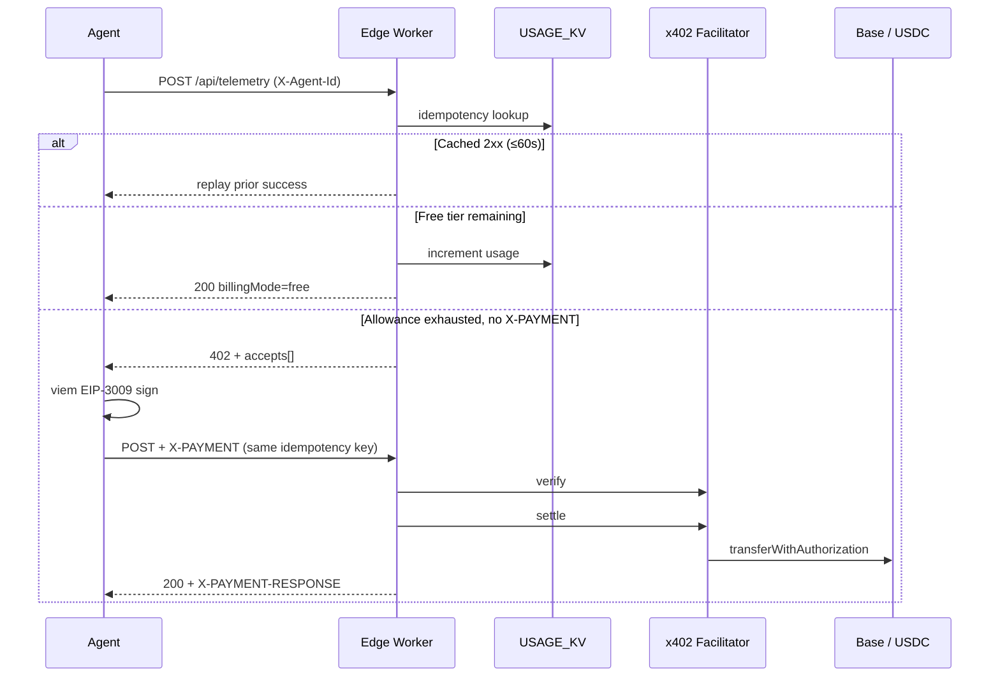

# Tollbase Canonical Wiki

Architectural deep dive for technical leads, protocol builders, and developer communities. This document describes **how** Tollbase turns HTTP into a machine-payable telemetry bus—not how to `npm install` it. For that, see [README.md](./README.md) and [QUICKSTART.md](./QUICKSTART.md).

---

## The Problem: Human-Centric Billing in an Autonomous World

Traditional SaaS monetization relies on human-centric rails—OAuth login walls, manual monthly subscriptions, and API keys tied to human identity. Autonomous AI agents operating in continuous execution loops cannot open browser tabs to enter credit card numbers or handle subscription invoices.

That mismatch is not a UX issue. It is a **protocol issue**. Agents speak HTTP. Billing speaks browsers, invoices, and identity providers. The result is either:

- telemetry sinks that stay free forever and get abused, or
- paid APIs that require a human to provision a key before the agent can run.

Tollbase assumes the caller is a loop, not a person. Identity is a stable `X-Agent-Id`. Money is an HTTP status code plus a signed authorization. Settlement happens on-chain, in USDC, on Base.

---

## The x402 Edge Solution

Tollbase resurrects the long-dormant HTTP `402 Payment Required` status code, transforming it into a high-speed machine-to-machine payment gateway.

| Property | Mechanic |
| --- | --- |
| **Zero cold starts** | Hosted globally on Cloudflare Workers. The ingest path is a Hono router at the edge—no container boot, no regional origin hop for the toll booth itself. Target: edge execution well under 50ms for cache hits and free-tier admits. |
| **Idempotency safeguards** | Built-in 60-second sliding TTL on processed keys in Workers KV. Network retries do not double-bill or skew telemetry counters. |
| **Instant micro-settlements** | The client uses **viem** to sign EIP-3009 `TransferWithAuthorization` typed data. The worker verifies and settles through the x402 facilitator, routing sub-cent USDC to the operator receiving wallet on Base (`0x985679C8…`, configured as `X402_PAY_TO`). |

Default price after the free tier: **$0.001 USDC per blip**. Protocol version: **x402 v1**, scheme `exact`, network `base`.



---

## Runtime Topology

```
Agent loop ──HTTP──► Cloudflare Worker (Hono)
                         │
                         ├─ Assets ── public/index.html (HUD)
                         ├─ USAGE_KV ── usage, idempotency, alerts, activity
                         ├─ x402 facilitator ── verify + settle
                         └─ optional Supabase ── telemetry_blips
```

| Layer | Implementation |
| --- | --- |
| Edge | `src/index.ts` — Hono app, `wrangler.jsonc` Worker `tollbase-core` |
| Client | `src/client.ts` — `TollbaseClient`, exported as package root |
| State | KV namespace `USAGE_KV` |
| Payments | `x402` (`exact` EVM scheme) + facilitator `https://x402.org/facilitator` |
| Chain | Base mainnet USDC via EIP-3009 |
| HUD | Static `public/` served for non-`/api/*` routes (`run_worker_first: ["/api/*"]`) |

The worker never holds the agent’s private key. Signing is strictly a client-side act. The worker only **challenges**, **verifies**, and **settles**.

---

## Request Pipeline (`POST /api/telemetry`)

Middleware order is load-bearing. Idempotency runs **before** the toll booth so a replay cannot increment usage or hit the facilitator.

### 1. Identity

`X-Agent-Id` is required. No OAuth. No cookie. The ID is the billing and usage primary key.

### 2. Idempotency gate

- If `X-Idempotency-Key` is present, that string is the key (SHA-256 if longer than 200 characters).
- If absent, the worker hashes `agentId + timestamp + raw body`.
- Lookup: `idem:{agentId}:{key}` in KV.
- **Hit on a prior 2xx:** return the cached JSON immediately, set `idempotentReplay: true` and `X-Idempotency-Replayed: true`. Skip usage, skip x402, skip persist.
- **Miss / 4xx / 402 never cached:** continue. Payment retries must be allowed to settle with the **same** key.
- On a new 2xx, the response (including `X-PAYMENT-RESPONSE` if present) is stored with `expirationTtl: 60`.

This is a sliding 60-second window, not a ledger. It exists to absorb UDP-like HTTP: timeouts, agent retries, and the SDK’s own 402→signed retry as one logical ingest.

### 3. Payment gate (free tier, then x402)

1. Load `usage:{agentId}` from KV.
2. If `blocked`, return **403 `AGENT_BLOCKED`**.
3. Resolve per-agent `freeTierLimit` (admin override) or the worker default (**100**).
4. If `usageCount < limit`, increment, set `billingMode: free`, continue.
5. Otherwise require payment:
   - No `X-PAYMENT` → **402** with `accepts[]` (scheme `exact`, network `base`, `maxAmountRequired` derived from `$0.001`, `payTo` checksummed via viem `getAddress`).
   - Header present → `exact.evm.decodePayment`, `findMatchingPaymentRequirements`, facilitator `verify`, then `next()`, then facilitator `settle` only if the handler returned &lt; 400. Settlement failure replaces the response with **402 `SETTLEMENT_FAILED`** so a failed on-chain step does not look like a successful ingest.

Paid requests do **not** increment the free-tier counter. The meter stays exhausted; every subsequent blip is a micro-settlement until an operator resets usage or raises the limit.

### 4. Persist

The handler writes a UUID blip. If `SUPABASE_URL` and `SUPABASE_SERVICE_ROLE_KEY` are set, it POSTs to `telemetry_blips`. Otherwise it logs locally. Last-seen metadata and a rolling activity feed are updated in KV for the HUD.

### 5. Low-balance alert (background)

If remaining free blips are ≤ **10**, and `last-alert:{agentId}` is older than **4 hours** (or missing), the worker `POST`s `env.ALERT_WEBHOOK_URL`. The fetch is scheduled with `c.executionCtx.waitUntil` so ingest latency does not include webhook RTT.

---

## State Model (KV)

| Key | Value | Lifetime |
| --- | --- | --- |
| `usage:{agentId}` | JSON: `count`, `lastEvent`, `lastSeen`, `billingMode`, optional `freeTierLimit`, `blocked` | Durable |
| `idem:{agentId}:{key}` | Cached 2xx body + status + optional payment response header | 60s TTL |
| `last-alert:{agentId}` | ISO timestamp of last low-balance webhook | ~4h TTL |
| `activity:recent` | Last 40 ingest events for the HUD | Durable, capped |

KV is the source of truth for **billing posture**. Postgres is an optional log sink, not the meter.

---

## Client Settlement Path

`TollbaseClient` (`src/client.ts`):

1. `POST /api/telemetry` with `X-Agent-Id` and optional `X-Idempotency-Key`.
2. On 402, if `privateKey` or `signer` is configured and `autoRetryPayment` is true (default when a signer exists): `selectPaymentRequirements` → `createPaymentHeader` (EIP-3009 typed data via viem) → retry with `X-PAYMENT`, **same idempotency key**.
3. Discriminated result: `{ ok: true, data, paidViaRetry? }` or `{ ok: false, paymentRequired: true, challenge }`.

The wallet must hold **USDC on Base**. The authorization is `transferWithAuthorization`, not an ETH transfer. Gas for the facilitator-side submission is not the agent’s problem in this design; the agent only signs.

---

## Operator Surface

| Verb | Path | Role |
| --- | --- | --- |
| `GET` | `/` | HUD (assets) |
| `GET` | `/api` | Discovery |
| `GET` | `/api/telemetry/status` | Per-agent meter (`X-Agent-Id`) |
| `GET` | `/api/telemetry/overview` | Fleet snapshot |
| `POST` | `/api/telemetry` | Ingest / toll booth |
| `POST` | `/api/admin/agent` | `reset` · `set_limit` · `block` · `unblock` (`X-Admin-Key` = `ADMIN_SECRET`) |

Admin credentials are compared as SHA-256 digests to avoid leaking secret length through naive string compare. There is no public “create API key” flow—by design.

---

## Trust and Non-Goals

**Trusted**

- Cloudflare edge for challenge issuance and KV meters.
- x402 facilitator for EIP-3009 verify/settle against Base.
- Operator wallet (`X402_PAY_TO`) as payee.

**Not in this system**

- Human identity, OAuth, or credit cards.
- Guaranteed exactly-once ingest beyond the 60s idempotency window (two parallel first-seen keys can still race).
- Custodial wallets for agents.
- x402 v2 (`@x402/core`). This worker speaks **v1**.

The product thesis is narrow: **HTTP in, telemetry persisted, money moved only when the loop has used its free wire.** Everything else—dashboards, webhooks, admin blocks—is instrumentation around that thesis.

---

## Further reading

- [x402 protocol](https://www.x402.org/) and facilitator at `https://x402.org/facilitator`
- EIP-3009 `transferWithAuthorization`
- Cloudflare Workers + KV
- Implementation: `src/index.ts` (gates), `src/client.ts` (signer)
